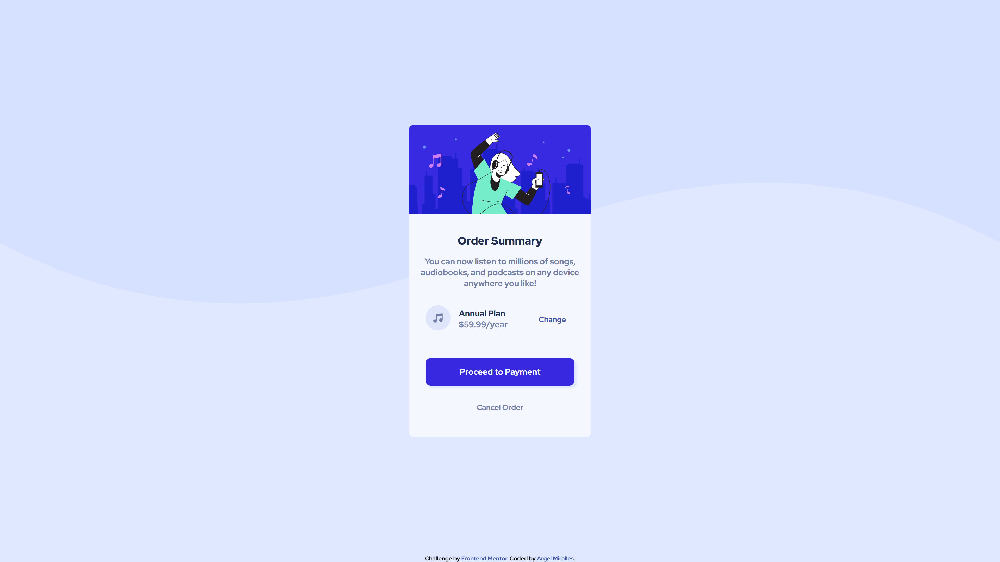

# Frontend Mentor - Order summary card

Note: The photo above is the design preview for the challenge. The actual preview of my project can be seen below.

## Welcome! 👋

Thanks for checking out this front-end coding challenge.
This is a simple web application showcasing my command of HTML and CSS.

## The challenge

The main challenge here is laying out the cards sections correctly, especially the part the includes the price, subscription plan and call-to-action button.

## My solution

I mainly used the CSS Flexbox in the card sections to lay out the elements correctly. In the problematic section mentioned above, I used a nested flex box to beat the challenge.

## Technologies used

- HTML - Used to create the index.html file
- CSS - Used to design the webpage
- VSCode - IDE I used to create the web app
- Git - For version control
- Netflify - Used to host this web app

## Preview

## Deployment

You may visit the deployed web app through the link below.

- [https://amiralles-ordersummarycard.netlify.app/](https://amiralles-ordersummarycard.netlify.app/)

## Footer

Thank you for taking the time in checking out this repository.

**Argel Miralles | Full Stack Web Developer** 
**SIC PARVIS MAGNA**☝
